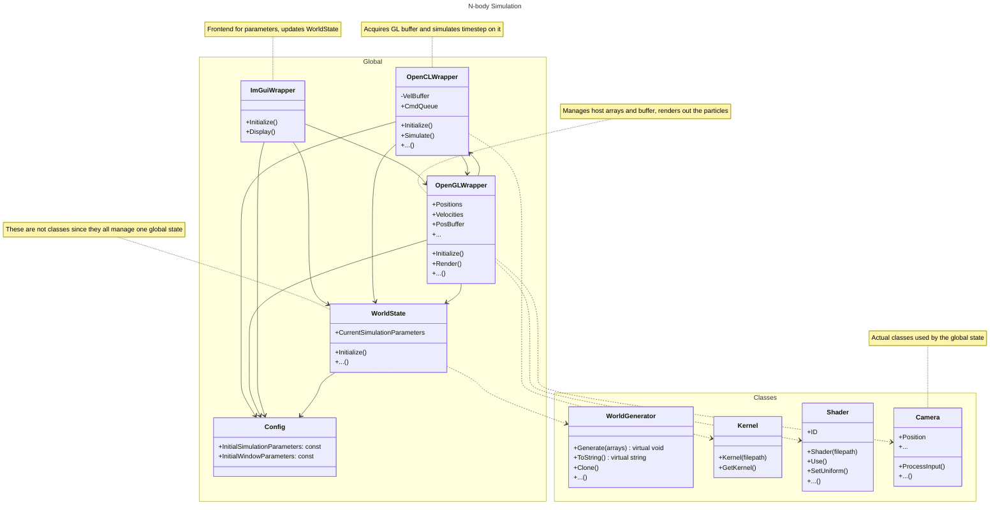

```mermaid
---
title: N-body Simulation
---
classDiagram
note for WorldState "These are not classes since they all manage one global state"
note for Camera "Actual classes used by the global state"
note for OpenCLWrapper "Acquires GL buffer and simulates timestep on it"
note for OpenGLWrapper "Manages host arrays and buffer, renders out the particles"
note for ImGuiWrapper "Frontend for parameters, updates WorldState"

WorldState..>WorldGenerator
OpenCLWrapper..>Kernel
OpenGLWrapper..>Shader
OpenGLWrapper..>Camera

OpenCLWrapper-->Config
OpenGLWrapper-->Config
ImGuiWrapper-->Config
WorldState-->Config

ImGuiWrapper-->OpenGLWrapper
OpenCLWrapper-->OpenGLWrapper
OpenGLWrapper-->OpenCLWrapper

ImGuiWrapper-->WorldState
OpenCLWrapper-->WorldState
OpenGLWrapper-->WorldState
namespace Global {
  class Config {
    +InitialSimulationParameters: const
    +InitialWindowParameters: const
  }
  class WorldState {
    +CurrentSimulationParameters
    +Initialize()
    +...()
  }
  class OpenGLWrapper {
    +Positions
    +Velocities
    +PosBuffer
    +...
    +Initialize()
    +Render()
    +...()
  }
  class OpenCLWrapper {
    -VelBuffer
    +CmdQueue
    +Initialize()
    +Simulate()
    +...()
  }
  class ImGuiWrapper {
    +Initialize()
    +Display()
  }
}
namespace Classes {
  class Shader {
    +ID
    +Shader(filepath)
    +Use()
    +SetUniform()
    +...()
  }
  class Camera {
    +Position
    +...
    +ProcessInput()
    +...()
  }
  class Kernel {
    +Kernel(filepath)
    +GetKernel()
  }
  class WorldGenerator {
    +Generate(arrays) virtual void
    +ToString() virtual string
    +Clone()
    +...()
  }
}

```