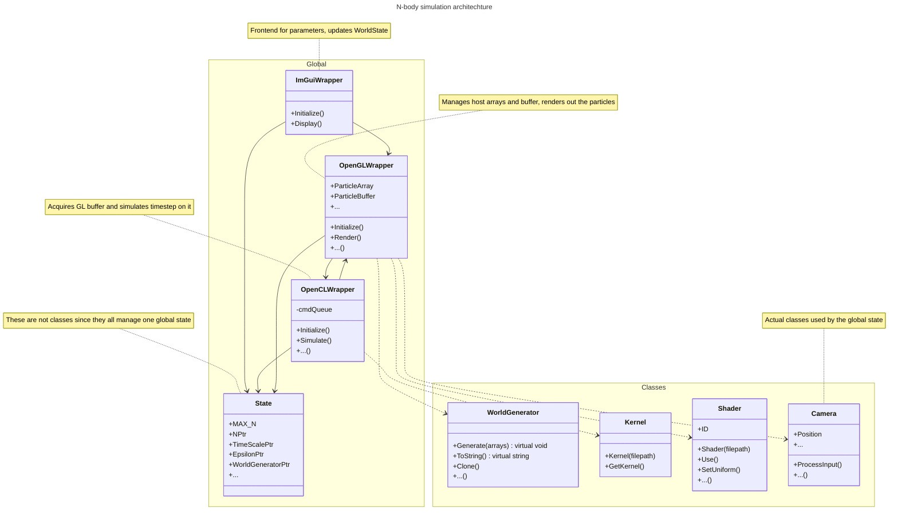

# About this project

This project showcases OpenCL/OpenGL interoperability through a simulation of gravitational forces acting on n particles. 
Employing a brute-force algorithm with O(n²) complexity, it leverages the power of parallel computing to manage and render the simulation efficiently. 
The project is developed entirely in C++, utilizing GLFW 3, GLAD, and GLM for high-performance rendering with OpenGL, and features a user-friendly interface built with ImGui. 
Adhering to the OpenCL 1.2 specification, it demonstrates the seamless integration of compute and graphics processing for sophisticated simulations.

> [!NOTE]
> 
> This project is designed for use with a dedicated graphics card. While OpenCL and OpenGL can theoretically run without a GPU, this program assumes you have both a GPU and the necessary GPU drivers installed.

# Usage

There are some **pre-built executables** for **Windows / MacOS / Linux**.
These were all tested on an NVIDIA GPU but should work on other platforms, granted the **OpenCL / OpenGL sharing extension** is supported by the device.
You can find the files [here]()


## Controls

- Use <kbd>w</kbd> / <kbd>a</kbd> / <kbd>s</kbd> / <kbd>d</kbd> for **up**/**left**/**down**/**right** respectively
- Hold <kbd>right-click</kbd> and move the mouse to look around the scene

# Building from source

## Linux

### Install dependencies

```console
sudo apt-get update
sudo apt-get install -y \
    build-essential cmake pkg-config python3 git \
    libxkbcommon-dev xorg-dev libwayland-dev
```

## MacOS

### Install C++ compiler

```console
xcode-select --install
```

### Install Homebrew package manager

1. Run the following command:
```console
/bin/bash -c "$(curl -fsSL https://raw.githubusercontent.com/Homebrew/install/HEAD/install.sh)"
```
2. Follow installer instructions to add brew to PATH

### Install dependencies

```console
brew update
brew install cmake python3
```

## Windows

### Install a C++ compiler (e.g. MinGW-w64)

If you choose to install MinGW-w64, follow the instructions on [MSYS2](https://www.msys2.org/)

### Install CMake (3.10+)

Download and install [CMake](https://cmake.org/download/)

### Install Git for Windows

Download and install [Git](https://git-scm.com/download/win)

# Building

### Clone this repository

```console
git clone https://github.com/22ms/n-body-sim.git
```

### Setting up your build directory

```console
mkdir build
cd build
cmake ..
```

### Compiling the project

```console
cmake --build .
```

### Executing the program

```console
./n-body
```

# Program architechture


